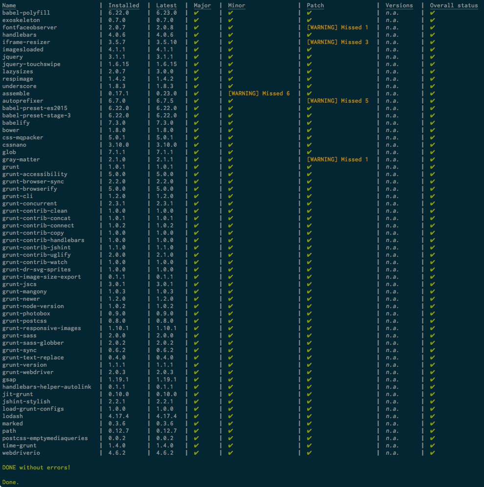

[](https://badge.fury.io/gh/pixel-shock%2Fgrunt-npm-check-updates)
[](https://badge.fury.io/js/grunt-npm-check-updates)
[](https://travis-ci.org/pixel-shock/grunt-npm-check-updates)
[](https://github.com/pixel-shock/grunt-npm-check-updates)
[](https://github.com/pixel-shock/grunt-npm-check-updates/issues)
[](https://github.com/pixel-shock/grunt-npm-check-updates/stargazers)
[](https://github.com/pixel-shock/grunt-npm-check-updates/network)
[](https://raw.githubusercontent.com/pixel-shock/grunt-npm-check-updates/master/LICENSE-MIT)
[](http://gruntjs.com/)

# grunt-npm-check-updates

> A Grunt Task that checks the update capabilities for each installed modules (without their dependencies).

## Getting Started
This plugin requires Grunt `~0.4.5`

If you haven't used [Grunt](http://gruntjs.com/) before, be sure to check out the [Getting Started](http://gruntjs.com/getting-started) guide, as it explains how to create a [Gruntfile](http://gruntjs.com/sample-gruntfile) as well as install and use Grunt plugins. Once you're familiar with that process, you may install this plugin with this command:

```shell
npm install grunt-npm-check-updates --save-dev
```

Once the plugin has been installed, it may be enabled inside your Gruntfile with this line of JavaScript:

```js
grunt.loadNpmTasks('grunt-npm-check-updates');
```

## The "grunt-npm-check-updates" task

### Example output



### Overview
In your project's Gruntfile, add a section named `grunt-npm-check-updates` to the data object passed into `grunt.initConfig()`.

```js
grunt.initConfig({
  'grunt-npm-check-updates': {
    include: {
        production: true,
        develop: true,
        optional: false,
        jsonFile: 'package.json',
    },
    output: {
        visual: true,
        xml: true,
        xmlFilename: 'grunt-npm-check-updates.xml',
        xmlTemplate: '<?xml version="1.0"?><modules>{{#each modules}}<module name="{{{ this.name }}}" installed="{{{ this.installed }}}" latest="{{{ this.latest }}}" missedMajors="{{{ this.missedMajors }}}" missedMinors="{{{ this.missedMinors }}}" missedPatches="{{{ this.missedPatches }}}" status="{{{ this.status }}}"><versions>{{{ this.versions }}}</versions></module>{{/each}}</modules>',
        json: true,
        jsonFilename: 'grunt-npm-check-updates.json',
        jsonTemplate: '{"modules": [{{#each modules}}{{#if @last }}{"name": "{{{ this.name }}}","installed": "{{{ this.installed }}}","latest": "{{{ this.latest }}}","missedMajors": "{{{ this.missedMajors }}}","missedMinors": "{{{ this.missedMinors }}}","missedPatches": "{{{ this.missedPatches }}}","versions": "{{{ this.versions }}}","status": "{{{ this.status }}}"}{{else}}{"name": "{{{ this.name }}}","installed": "{{{ this.installed }}}","latest": "{{{ this.latest }}}","missedMajors": "{{{ this.missedMajors }}}","missedMinors": "{{{ this.missedMinors }}}","missedPatches": "{{{ this.missedPatches }}}","versions": "{{{ this.versions }}}","status": "{{{ this.status }}}"},{{/if}}{{/each}}]}',
    },
    global: {
        missedMajors: {
            allowed: 0,
            level: 'error',
        },
        missedMinors: {
            allowed: 1,
            level: 'warn',
        },
        missedPatches: {
            allowed: 0,
            level: 'warn',
        },
        showVersions: false,
    },
    modules: {}
});
```

### Task Options

#### include.jsonFile
Type: `String`<br>
Default value: `package.json`<br>

The path of the package.json.

#### include.production
Type: `Boolean`<br>
Default value: `true`<br>

Indicates whether the `dependencies` should be included in the test.

#### include.development
Type: `Boolean`<br>
Default value: `true`<br>

Indicates whether the `devDependencies` should be included in the test.

#### include.optional
Type: `Boolean`<br>
Default value: `true`<br>

Indicates whether the `optionalDependencies` should be included in the test.

#### output.visual
Type: `Boolean`<br>
Default value: `true`<br>

Indicates whether the result of the tests should be printed to the console.

#### output.xml
Type: `Boolean`<br>
Default value: `true`<br>

Indicates whether the result of the tests should be written to a xml file.

#### output.xmlFilename
Type: `String`<br>
Default value: `npm-check-updates.xml`<br>

The filename for the `options.xml` option.

#### output.xmlTemplate
Type: `String`<br>
Default value: `<?xml version="1.0"?><modules>{{#each modules}}<module name="{{{ this.name }}}" installed="{{{ this.installed }}}" latest="{{{ this.latest }}}" missedMajors="{{{ this.missedMajors }}}" missedMinors="{{{ this.missedMinors }}}" missedPatches="{{{ this.missedPatches }}}" status="{{{ this.status }}}"><versions>{{{ this.versions }}}</versions></module>{{/each}}</modules>`

The Handlebars template for the XML file output.

#### output.json
Type: `Boolean`<br>
Default value: `true`<br>

Indicates whether the result of the tests should be written to a json file.

#### output.jsonFilename
Type: `String`<br>
Default value: `npm-check-updates.json`<br>

The filename for the `options.json` option.

#### output.jsonTemplate
Type: `String`<br>
Default value: `{"modules": [{{#each modules}}{{#if @last }}{"name": "{{{ this.name }}}","installed": "{{{ this.installed }}}","latest": "{{{ this.latest }}}","missedMajors": "{{{ this.missedMajors }}}","missedMinors": "{{{ this.missedMinors }}}","missedPatches": "{{{ this.missedPatches }}}","versions": "{{{ this.versions }}}","status": "{{{ this.status }}}"}{{else}}{"name": "{{{ this.name }}}","installed": "{{{ this.installed }}}","latest": "{{{ this.latest }}}","missedMajors": "{{{ this.missedMajors }}}","missedMinors": "{{{ this.missedMinors }}}","missedPatches": "{{{ this.missedPatches }}}","versions": "{{{ this.versions }}}","status": "{{{ this.status }}}"},{{/if}}{{/each}}]}`

The Handlebars template for the JSON file output.

### Global Test Options

#### global.missedMajors
Type: `Object`<br>
Default value: `missedMajors: {allowed: false, level: 'error'}`<br>

Defines the allowed (or not allowed) missed major releases.

#### global.missedMajors.allowed
Type: `Integer|Boolean`<br>
Default value: `0`<br>

Indicates the count of missed majors updates which could pass the test. Set to `true` to allow infinite missed majors updates.

#### global.missedMajors.level
Type: `String`<br>
Default value: `error`<br>
Allowed values: `error`, `warn`, `debug`

Indicates how cirital a missed major update is.<br>
`error` means that the Grunt Task will fail.<br>
`warn` means that the Grunt Task will only warn.<br>
`debug` mean that the Task will only with `--debug` flag output some text.

#### global.missedMinors
Type: `Object`<br>
Default value: `missedMinors: {allowed: false, level: 'error'}`<br>

Defines the allowed (or not allowed) missed minor releases.

#### global.missedMinors.allowed
Type: `Integer|Boolean`<br>
Default value: `0`<br>

Indicates the count of missed minors updates which could pass the test. Set to `true` to allow infinite missed minors updates.

#### global.missedMinors.level
Type: `String`<br>
Default value: `error`<br>
Allowed values: `error`, `warn`, `debug`

Indicates how cirital a missed minor update is.<br>
`error` means that the Grunt Task will fail.<br>
`warn` means that the Grunt Task will only warn.<br>
`debug` mean that the Task will only with `--debug` flag output some text.

#### global.missedPatches
Type: `Object`<br>
Default value: `missedPatches: {allowed: false, level: 'error'}`<br>

Defines the allowed (or not allowed) missed patch releases.

#### global.missedPatches.allowed
Type: `Integer|Boolean`<br>
Default value: `0`<br>

Indicates the count of missed patch updates which could pass the test. Set to `true` to allow infinite missed patch updates.

#### global.missedPatches.level
Type: `String`<br>
Default value: `error`<br>
Allowed values: `error`, `warn`, `debug`

Indicates how cirital a missed patch update is.<br>
`error` means that the Grunt Task will fail.<br>
`warn` means that the Grunt Task will only warn.<br>
`debug` mean that the Task will only with `--debug` flag output some text.

#### global.showVersions
Type: `Boolean`<br>
Default value: `false`<br>

Indicates the whether the XML output or the console output should display the version history of a module.


### Module specific Test Options

See the **Global Test Options**.<br>
Just wrap the options into an object with the name of the npm module as key.

```
modules: {
    grunt: {
        missedMajors: {
            ...
        }
    }
}
```


## Release History

### 1.1.2
* fixed issue https://github.com/pixel-shock/grunt-npm-check-updates/issues/2
** thanks to Matthew Mitchell (https://github.com/mmitchell80)
* fixed issue https://github.com/pixel-shock/grunt-npm-check-updates/issues/1
** thanks to Matthew Mitchell (https://github.com/mmitchell80)
* switched to yarn

### 1.1.1
* fixed typo for "jsonFileName" to "jsonFilename"

### 1.1.0
* removed XMLWriter package
* added Handelbars package
* add XML Handlebars Template option
* add JSON Handlebars Template option

### 1.0.0
* moved Helper.js & Comparator.js into "lib" dir
* removed Progressbar
* changed graphical output

### 0.1.3
* upgraded required node version

### 0.1.2
* refactored code
* added tests

### 0.1.1
* changed options to be more distinct
* fixed ``--debug`` flag identification for task

### 0.1.0
* first release

## TODO

* add more tests (if necessary)
